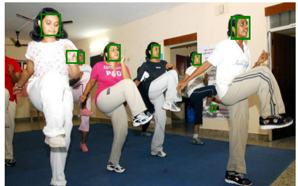
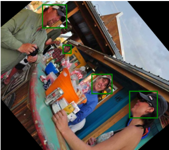
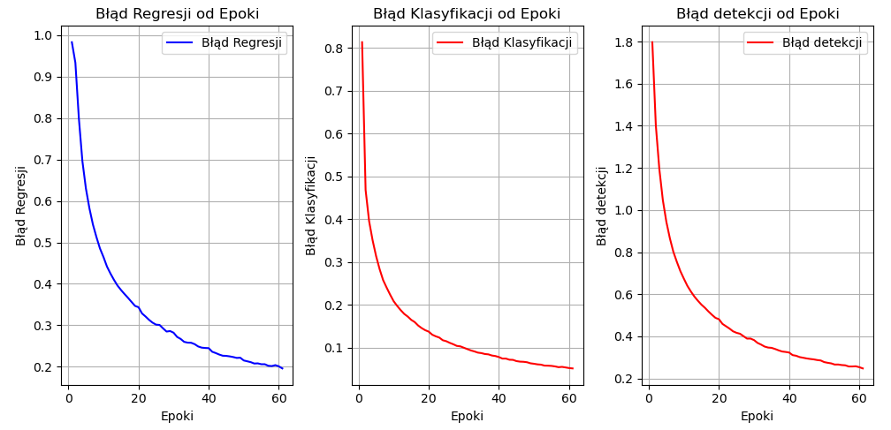
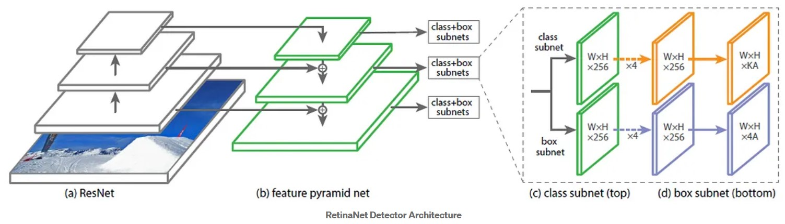
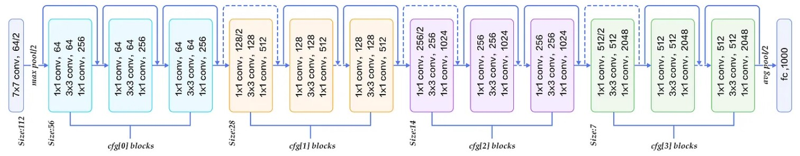

# Intro
The project created in a two-person team. Implementation of RetinaNet architecture in a face detection task. Training and evaluation on a Wider dataset.   
* **project documentation**: https://github.com/jkwiatk1/retinanet-face-detection/blob/main/data/Dokumentacja_ko%C5%84cowa_GSN.pdf 
* **result presentation**: https://github.com/jkwiatk1/retinanet-face-detection/blob/main/data/GSN%20-%20Etap%203.pptx

# Results
### Images
* normal:  

* With augumentation:  

### Training:
* training loss:  

* coco metrics:  

# RetinaNet for Face Detection
* white paper: [link](https://arxiv.org/pdf/1708.02002v2.pdf)
* article: [link](https://towardsdatascience.com/review-retinanet-focal-loss-object-detection-38fba6afabe4)

### RetinaNet architecture 

## ResNet50
Backbone created using the PyTorch model with pre-trained weights. 
* white paper: [link](https://www.cv-foundation.org/openaccess/content_cvpr_2016/papers/He_Deep_Residual_Learning_CVPR_2016_paper.pdf)
* article_1: [link](https://towardsdatascience.com/review-resnet-winner-of-ilsvrc-2015-image-classification-localization-detection-e39402bfa5d8)

### ResNet50 architecture

## Feature Pyramid Network
Created based on:
* white paper: [link](https://openaccess.thecvf.com/content_cvpr_2017/papers/Lin_Feature_Pyramid_Networks_CVPR_2017_paper.pdf)
* article_1: [link](https://jonathan-hui.medium.com/understanding-feature-pyramid-networks-for-object-detection-fpn-45b227b9106c)
* article_2: [link](https://towardsdatascience.com/review-fpn-feature-pyramid-network-object-detection-262fc7482610)
* article_3: [link](https://medium.com/@freshtechyy/fusing-backbone-features-using-feature-pyramid-network-fpn-c652aa6a264b)

Low resolution feature maps capture more global information of the image and represent richer semantic meaning while the high resolution feature maps focus more on the local information and provide more accurate spatial information. 
The goal of FPN is to combine the high and low resolution feature maps to enhance the features with both accurate spatial information and rich semantic meaning. 
FPN extracts feature maps and later feeds into a detector, like RPN.

## Generating Anchor Boxes (RPN)
RPN applies a sliding window over the feature maps to make predictions on the objectness (has an object or not) and the object boundary box at each location.

For each scale level (say P4), a 3 × 3 convolution filter is applied over the feature maps followed by separate 1 × 1 convolution for objectness predictions and boundary box regression. These 3 × 3 and 1 × 1 convolutional layers are called the RPN head. The same head is applied to all different scale levels of feature maps.

## Box Regression and Classification Heads
#### Classification Subnet
Classification subnet predicts the probability of object presence at each spatial position for each of the A anchors and K object classes.  
The subnet is a FCN which applies four 3×3 conv layers, each with C filters and each followed by ReLU activations, followed by a 3×3 conv layer with KA filters. (K classes, A=9 anchors, and C = 256 filters)

#### Box Regression Subnet
Regression subnet is a FCN to each pyramid level for the purpose of regressing the offset from each anchor box to a nearby ground-truth object, if one exists.  
It is identical to the classification subnet except that it terminates in 4A linear outputs per spatial location.  
It is a class-agnostic bounding box regressor which uses fewer parameters, which is found to be equally effective.

## Focal loss
During training, the total focal loss of an image is computed as the sum of the focal loss over all 100k anchors, normalized by the number of anchors assigned to a ground-truth box.